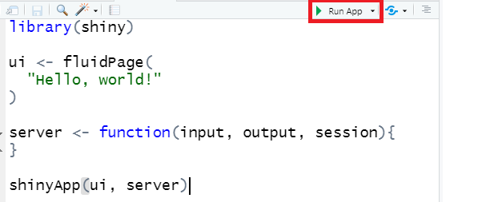
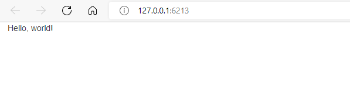
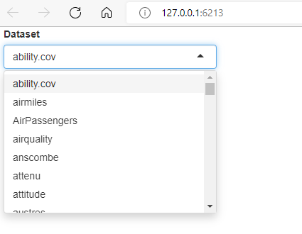
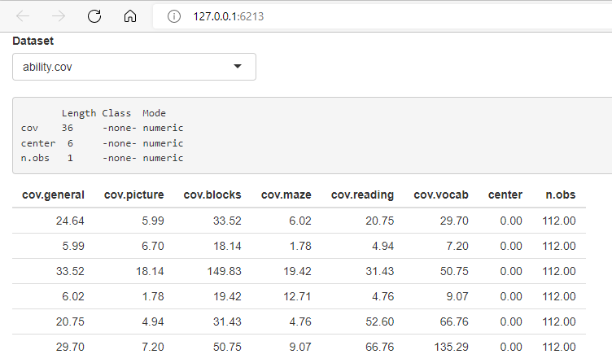

```{r setup, include=FALSE}
knitr::opts_chunk$set(echo = TRUE, eval = FALSE, warning = FALSE, message = FALSE)
```

## Quem sou eu

-   Bacharelado em Estatística (ENCE, 2013)
-   Mestrado em Eng. Elétrica (PUC-Rio, 2015)
-   Doutorado em Eng. de Produção (PUC-Rio, 2018)
-   Pós-doutorado em Eng. de Produção (PUC-Rio, 2019)
-   Professora Adjunta desde 2019 (DEI, PUC-Rio)

\flushright {width="50%"}

## Me encontre em

-   github.com/paulamacaira
-   sites.google.com/view/paulamacaira
-   [paulamacaira\@puc-rio.br](mailto:paulamacaira@puc-rio.br){.email}

\flushright {width="40%"}

## Premissas

-   Presumo que você conheça minimamente a **linguagem R** e o meio ambiente **RStudio**

## Falaremos sobre...

1. estrutura básica de um Shiny App
2. fundamentos da programação reativa
3. entendendo o layout
4. pacotes plotly, dygraphs e leaflet
5. como publicar seu Shiny App

\center {width="50%"}

## ...

{width="100%"}

## O que é um Shiny App

- Shiny é um pacote R que permite criar facilmente aplicativos web interativos
- Esse pacote permite que você pegue seu trabalho em \texttt{R} e o exponha por meio de um navegador da web para que qualquer pessoa possa usá-lo de maneira simples e de graça
- No passado, criar aplicativos web era difícil para a maioria dos usuários de \texttt{R} porque precisava de um profundo conhecimento de tecnologias da web como HTML, CSS e JavaScript

## Vantagens de um Shiny App

- O Shiny tornou significativamente mais fácil para o programador de R criar aplicativos da web ao:

(i) fornecer um conjunto selecionado de funções de interface do usuário (UI para abreviar) que geram o HTML, CSS e JavaScript necessários para tarefas comuns, ou seja, você não precisa conhecer os detalhes de HTML/CSS/JavaScript se não quiser; 

(ii) apresentar a programação reativa que sempre que uma entrada muda atualiza todas as saídas relacionadas.

## Para o que um Shiny App é utilizado

- O Shiny é utilizado para uma variedade de finalidades, por exemplo:
  + para criar painéis que mostrem importantes indicadores de desempenho de alto nível, enquanto facilitam o detalhamento das métricas que precisam de mais investigação;
  + substituir centenas de páginas de PDFs por aplicativos interativos que permitem ao usuário saltar para a fatia exata dos resultados que lhe interessam;
  + comunicar modelos complexos a um público não técnico com visualizações informativas e análise de sensibilidade interativa;
  + fornecer análise de dados de autoatendimento para fluxos de trabalho comuns, substituindo solicitações de e-mail por um aplicativo Shiny que permite que as pessoas carreguem seus próprios dados e realizem análises padrão
  
## Mais possibilidades de um Shiny App

- Com o Shiny você consegue criar demonstrações interativas para ensinar estatística e conceitos de ciência de dados que permitem que os usuários ajustem as entradas e observem os efeitos posteriores dessas alterações em uma análise

Resumindo, o Shiny lhe dá a habilidade de passar alguns de seus superpoderes \texttt{R} para qualquer um que possa usar a web e não tenham qualquer habilidade de programação.

## Exibição de alguns Shiny Apps

https://shiny.rstudio.com/gallery/

## Seu primeiro Shiny App

- Se você ainda não instalou o Shiny, faça agora

```{r}
install.packages("shiny")
```

- Em seguida, carregue em sua sessão R atual

```{r}
library(shiny)
```

## Seu primeiro Shiny App

- Existem várias maneiras de criar um aplicativo Shiny
- O mais simples é criar um novo diretório para seu aplicativo e colocar um único arquivo chamado **app.R** nele
- Este arquivo **app.R** será usado para informar ao Shiny como seu aplicativo deve ser e como ele deve se comportar

Experimente criando um novo diretório e adicionando um arquivo **app.R** parecido com o seguinte

## Seu primeiro Shiny App

```{r}
library(shiny)

ui <- fluidPage(
  "Hello, world!"
)

server <- function(input, output, session){
}

shinyApp(ui, server)
```

## Seu primeiro Shiny App

Embora trivial, este é um aplicativo Shiny completo! 

- Observando atentamente o código acima, nosso **app.R** faz quatro coisas:

1. Ele chama **library(shiny)** para carregar o pacote shiny
2. Ele define a interface do usuário, a página da Web HTML com a qual os humanos interagem. Neste caso, é uma página contendo as palavras “Hello, world!”
3. Ele especifica o comportamento do nosso aplicativo definindo uma função de servidor. No momento, está vazio, então nosso aplicativo não faz nada, mas voltaremos para revisitar isso em breve
4. Ele executa **shinyApp(ui, server)** para construir e iniciar um aplicativo Shiny a partir da interface do usuário e do servidor

## Dica do RStudio

Existem duas maneiras convenientes de criar um novo aplicativo no RStudio:

- Crie um novo diretório e um arquivo **app.R** contendo um aplicativo básico em uma etapa clicando em **File | New Project** e, em seguida, selecionando **New Directory** e **Shiny Web Application**
- Se você já criou o arquivo **app.R**, pode adicionar rapidamente a estrutura básica do aplicativo digitando “shinyapp” e pressionando **Shift+Tab**

## Como rodar o app

Para rodar o app, clique em **RunApp**

\center{width="100%"}

## Verificando se você fez certo

Rode o **app.R** e verifique se você vê o mesmo aplicativo da Figura abaixo

\center{width="100%"}

Parabéns! Você fez seu primeiro aplicativo Shiny.

## Workflow de um Shiny App

O workflow básico do desenvolvimento de aplicativos Shiny é:

- escrever algum código
- iniciar o aplicativo
- brincar com o aplicativo
- escrever mais código e repetir

Se você estiver usando o RStudio, nem precisa parar e reiniciar o aplicativo para ver suas alterações - você pode pressionar o botão **Reload App**.

## Adicionando controles UI

- Vamos adicionar algumas entradas e saídas à nossa UI para que nosso Shiny App não seja tão mínimo
- Inicialmente, vamos fazer um aplicativo muito simples que mostra todos os conjuntos de dados incluídos no pacote *datasets*

Substitua sua UI por este código:

```{r}
ui <- fluidPage(
  selectInput("dataset", label = "Dataset", 
              choices = ls("package:datasets")),
  verbatimTextOutput("summary"),
  tableOutput("table")
)
```

## Destrinchando o que fizemos

Este exemplo usa quatro novas funções:

- **fluidPage()** é uma função de layout que configura a estrutura visual básica da página. Existem muitas outras estruturas possíveis, sugiro olhar esse [material](https://mastering-shiny.org/action-layout.html#layout).
- **selectInput()** é um controle de entrada que permite que o usuário interaja com o aplicativo fornecendo um valor. Nesse caso, é uma caixa de seleção com o rótulo "Dataset" e permite que você escolha um dos conjuntos de dados incluídos no pacote *datasets*. Existem muitos outros tipos de entrada, sugiro olhar esse [material](https://mastering-shiny.org/basic-ui.html#inputs).
- **verbatimTextOutput()** e **tableOutput()** são controles de saída que informam ao Shiny onde colocar a saída. **verbatimTextOutput()** exibe código e **tableOutput()** exibe tabelas. Existem muitos outros tipos de saída, sugiro olhar esse [material](https://mastering-shiny.org/basic-ui.html#outputs)

## Funções de layout, entradas e saídas

Em suma, funções de layout, entradas e saídas têm usos diferentes, mas são fundamentalmente as mesmas nos bastidores: são apenas maneiras sofisticadas de gerar HTML e, se você chamar qualquer um deles fora de um aplicativo Shiny, verá um HTML impresso no console

Não tenha medo de bisbilhotar para ver como esses vários layouts e controles funcionam nos bastidores.

## Verificando o Shiny App

- Vá em frente e execute o **app.R** novamente
- Agora você verá uma página contendo uma caixa de seleção

\center{width="50%"}

- Vemos apenas a entrada, não as duas saídas, porque ainda não dissemos ao Shiny como a entrada e as saídas estão relacionadas.

## Adicionando tipos de saída

- Agora, daremos vida às saídas definindo-as na função do servidor
- O Shiny usa programação reativa para tornar os aplicativos interativos
- Por enquanto, é suficiente saber que programação reativa envolve dizer ao Shiny como realizar um cálculo, não ordenar ao Shiny que realmente o faça
- Ou seja, diremos ao Shiny como preencher as saídas **verbatimTextOutput()** e **tableOutput()** no aplicativo de exemplo, fornecendo as “receitas” para essas saídas

## Adicionando tipos de saída

Substitua sua função de servidor vazia por esta:

```{r}
server <- function(input, output, session) {
  output$summary <- renderPrint({
    dataset <- get(input$dataset, "package:datasets")
    summary(dataset)
  })
  
  output$table <- renderTable({
    dataset <- get(input$dataset, "package:datasets")
    dataset
  })
}
```

## Destrinchando o que fizemos

- O lado esquerdo do operador de atribuição (<-), **output$ID**, indica que você está fornecendo a receita para a saída Shiny com esse ID
- O lado direito da atribuição usa uma função de renderização específica para agrupar algum código que você fornece
- Cada função **render{Type}** é projetada para produzir um tipo específico de saída (por exemplo, texto, tabelas e gráficos) e geralmente é combinada com uma função **{type}Output**
- Por exemplo, neste aplicativo, **renderPrint()** é emparelhado com **verbatimTextOutput()** para exibir um resumo estatístico com texto de largura fixa (verbatim), e **renderTable()** é emparelhado com **tableOutput()** para mostrar os dados de entrada em uma tabela

## Verificando o Shiny App

- Vá em frente e execute o **app.R** novamente e brinque, observando o que acontece com a saída quando você altera uma entrada
- A Figura abaixo mostra o que você deve ver ao abrir o aplicativo

\center{width="70%"}

## Reduzindo a duplicação com expressões reativas

- Mesmo neste exemplo simples, temos algum código duplicado: a linha a seguir está presente em ambas as saídas.

```{r}
dataset <- get(input$dataset, "package:datasets")
```

- Em todo tipo de programação, é uma prática ruim ter código duplicado; pode ser um desperdício computacional e, mais importante, aumenta a dificuldade de manter ou depurar o código
- No script \texttt{R} tradicional, usamos duas técnicas para lidar com código duplicado: capturamos o valor usando uma variável ou capturamos a computação com uma função. Infelizmente, nenhuma dessas abordagens funciona aqui e precisamos de um novo mecanismo: expressões reativas

## Expressões reativas

- Você cria uma expressão reativa envolvendo um bloco de código em **reactive({...})** e atribuindo-o a uma variável, e usa uma expressão reativa chamando-a como uma função
- No entanto, enquanto parece que você está chamando uma função, uma expressão reativa tem uma diferença importante: ela só é executada na primeira vez que é chamada e depois armazena em cache seu resultado até que precise ser atualizado

## Usando expressões reativas

- Podemos atualizar nosso **server()** para usar expressões reativas\footnote{O aplicativo se comporta de forma idêntica, mas funciona com um pouco mais de eficiência porque só precisa recuperar o conjunto de dados uma vez, não duas}, conforme mostrado abaixo

```{r}
server <- function(input, output, session) {
  dataset <- reactive({
    get(input$dataset, "package:datasets")
  })

  output$summary <- renderPrint({
    summary(dataset())
  })
  
  output$table <- renderTable({
    dataset()
  })
}
```

## Resumo desta primeira parte

- Nesta primeira parte do curso, você criou um aplicativo simples - não é muito interessante ou útil, mas viu como é fácil construir um aplicativo da web usando seu conhecimento \texttt{R} existente
- Nos próximos momentos, você aprenderá mais sobre interfaces de usuário e programação reativa, os dois blocos básicos de construção do Shiny
- Agora é um ótimo momento para pegar uma cópia da folha de [dicas Shiny](https://www.rstudio.com/resources/cheatsheets/)
- Este é um ótimo recurso para ajudar a refrescar sua memória dos principais componentes de um aplicativo Shiny